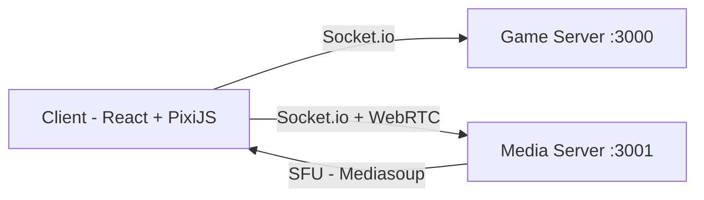

# 🌐 Metaverse

A real-time 2D multiplayer virtual world built for the browser. Walk around a pixel art landscape, bump into other players, chat with those nearby, and jump into spatial video calls.

> **Tech Stack:** React · PixiJS · Socket.io · Mediasoup (WebRTC) · TypeScript

---

## ✨ Features

- **Multiplayer World** — Walk around a tile-based 2D map rendered with PixiJS. Every player's movement is synchronized in real time via WebSockets.
- **Proximity Chat** — Text chat is scoped to nearby players. Walk into a group and you automatically join their conversation; walk away and you leave it.
- **Spatial Video Conferencing** — Peer-to-peer video and audio streams powered by Mediasoup (SFU). Approach other players to trigger a video call, step away to end it.
- **Dynamic Collision Map** — Tilemap-based collision detection prevents walking through walls and objects.
- **Room System** — Create or join rooms via unique IDs. Share a room link and friends can drop in instantly.
- **Named Avatars** — Choose a hero name on the landing page; it's visible to other players in the world.

---

## 🏛️ Architecture

The project is a monorepo with three independent services:

```
metaverse/
├── client/         → React + PixiJS frontend (Vite)
├── server/         → Game server — movement sync, rooms, proximity groups (Socket.io)
└── media-server/   → Media server — WebRTC video/audio via Mediasoup (SFU)
```



| Service | Default Port | Purpose |
|---|---|---|
| **Client** | `5173` | Vite dev server — serves the React/PixiJS frontend |
| **Game Server** | `3000` | Handles player movement, room management, proximity groups, and chat |
| **Media Server** | `3001` | Handles WebRTC transport creation, media routing via Mediasoup SFU |

---

## 🛠️ Tech Stack

### Client
| Technology | Role |
|---|---|
| [React](https://react.dev/) | UI framework |
| [PixiJS](https://pixijs.com/) + [@pixi/react](https://github.com/pixijs/pixi-react) | 2D WebGL rendering engine |
| [Vite](https://vitejs.dev/) | Build tool & dev server |
| [Socket.io Client](https://socket.io/) | Real-time communication |
| [mediasoup-client](https://mediasoup.org/) | WebRTC client for video/audio |
| [React Router](https://reactrouter.com/) | Client-side routing |
| TypeScript | Type safety |

### Game Server
| Technology | Role |
|---|---|
| [Socket.io](https://socket.io/) | WebSocket server for real-time game state |
| TypeScript + tsx | Runtime with hot reload |

### Media Server
| Technology | Role |
|---|---|
| [Mediasoup](https://mediasoup.org/) | SFU (Selective Forwarding Unit) for WebRTC |
| [Express](https://expressjs.com/) | HTTP server |
| [Socket.io](https://socket.io/) | Signaling for WebRTC negotiation |
| TypeScript + tsx | Runtime with hot reload |

---

## 📋 Prerequisites

- **Node.js** ≥ 18 (tested on v22)
- **npm** ≥ 9
- **Python 3** & **C++ build tools** — required by Mediasoup's native dependencies
  - macOS: `xcode-select --install`
  - Ubuntu/Debian: `sudo apt install python3 build-essential`

---

## 🚀 Getting Started

### 1. Clone the repository

```bash
git clone https://github.com/iyush05/metaverse.git
cd metaverse
```

### 2. Install dependencies

Install dependencies for all three services:

```bash
# Client
cd client && npm install

# Game Server
cd ../server && npm install

# Media Server
cd ../media-server && npm install
```

### 3. Configure environment variables

#### Client (`client/.env`)

Create a `.env` file in the `client/` directory:

```env
VITE_SERVER_URL="http://localhost:3000"
VITE_MEDIA_SERVER_URL="http://localhost:3001"
```

### 4. Start all services

Open **three terminal windows** and run each service:

```bash
# Terminal 1 — Game Server
cd server
npm run dev
```

```bash
# Terminal 2 — Media Server
cd media-server
npm run dev
```

```bash
# Terminal 3 — Client
cd client
npm run dev
```

### 5. Open the app

Visit **[http://localhost:5173](http://localhost:5173)** in your browser.

- Click **Enter Playground** to jump into the default room.
- Or scroll down to **Create** a new room / **Join** an existing one by Room ID.
- Share the Room ID with friends so they can join the same room.

---

## 📁 Project Structure

```
metaverse/
│
├── client/                          # Frontend (Vite + React + PixiJS)
│   ├── src/
│   │   ├── assets/                  # Sprites & tile maps (hero.png, tile-map.png)
│   │   ├── components/
│   │   │   ├── Camera/              # Camera follow & viewport
│   │   │   ├── Chat/                # Proximity chat UI
│   │   │   ├── Hero/                # Player avatar & other player rendering
│   │   │   ├── Landing/             # Landing page styles
│   │   │   ├── Levels/              # Tilemap & level rendering
│   │   │   ├── VideoCall/           # Video call button & UI
│   │   │   └── MainContainer.tsx    # Main game container
│   │   ├── constants/               # Game world constants & collision map
│   │   ├── helpers/                 # Utility functions
│   │   ├── mediasoup/               # Mediasoup client & video overlay
│   │   ├── pages/
│   │   │   ├── landingPage.tsx      # Landing / home page
│   │   │   └── playground.tsx       # Game room page
│   │   ├── services/                # Socket.io client instance
│   │   └── types/                   # TypeScript type definitions
│   ├── .env                         # Environment variables (git-ignored)
│   └── package.json
│
├── server/                          # Game Server
│   └── src/
│       ├── index.ts                 # Entry point — rooms, movement, proximity, chat
│       └── types/                   # Shared type definitions
│
├── media-server/                    # Media Server (Mediasoup SFU)
│   └── src/
│       ├── index.ts                 # Entry point — Express + Socket.io
│       ├── mediasoupConfig.ts       # Mediasoup worker/router/transport config
│       ├── Room.ts                  # Room abstraction for media routing
│       ├── RoomManager.ts           # Multi-room management & worker pool
│       └── socketHandlers.ts        # WebRTC signaling handlers
│
└── README.md
```

---

## 🎮 How It Works

1. **Landing Page** → Enter a hero name, create a new room, or join an existing one.
2. **Game World** → Your avatar spawns on a 2D pixel-art map. Use **arrow keys** to move.
3. **Proximity Groups** → The server continuously calculates player distances. When players are within **256px** of each other, they're grouped together.
4. **Chat** → Messages are only sent to players in your proximity group.
5. **Video Call** → Click the video call button while near other players to start a WebRTC video/audio session routed through the Mediasoup SFU.

---

## 📄 License

MIT — see footer on landing page or [LICENSE](LICENSE) file.

---

## 🤝 Contributing

Contributions are welcome! Feel free to open issues or submit pull requests on [GitHub](https://github.com/iyush05/metaverse).

---

## 📬 Contact

- **GitHub:** [@iyush05](https://github.com/iyush05)
- **Twitter:** [@iyush05](https://x.com/iyush05)
- **Email:** ayushkannaujiya@gmail.com
